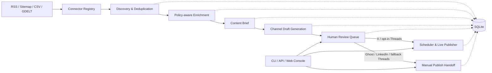

# SNS Content Engine

> 여러 뉴스 소스를 수집하고 채널별 초안을 생성한 뒤, 사람의 검토를 거쳐 안전하게 발행하는 설정 기반 콘텐츠 운영 시스템

이 프로젝트는 단순한 “LLM 글쓰기 스크립트”가 아니라 콘텐츠 수집, 출처 정책, 중복 제거, AI 공급자 라우팅, 편집 검수, 예약 발행, 감사 이력, 배포까지 하나의 운영 흐름으로 연결합니다. 한국·일본 뉴스를 글로벌 독자에게 전달하는 다계정 운영 시나리오를 기준으로 구현했습니다.

[기술 사례 분석](docs/portfolio-case-study.md) · [문서 전체 보기](docs/README.md) · [운영 콘솔 가이드](docs/operator-console-guide.md) · [배포 가이드](docs/single-server-deployment-guide.md)

## 프로젝트 한눈에 보기

| 구분 | 구현 내용 |
| --- | --- |
| 해결 과제 | 여러 출처와 SNS 계정을 한 시스템에서 운영하면서 저작권·중복·오발행 위험 통제 |
| 핵심 흐름 | 소스 탐색 → 수집·중복 제거 → 정책 기반 보강 → 콘텐츠 브리프 → 채널별 초안 → 사람 검수 → 예약/수동 발행 |
| 지원 소스 | RSS, Sitemap, Manual CSV, GDELT |
| 지원 채널 | X, Threads, Ghost, LinkedIn |
| 운영 화면 | CLI, FastAPI JSON API, 서버 렌더링 웹 콘솔 |
| 안전 장치 | 기본 dry-run, 명시적 live opt-in, 수동 승인, 출처 표기, 비밀정보 환경변수 분리, 감사 로그 |
| 검증 | Python 3.13 환경에서 자동화 테스트 561개 통과 |
| 배포 | SQLite 기반 단일 서버, systemd 이중 프로세스, Caddy HTTPS/Basic Auth, 백업·롤백 절차 |

## 왜 만들었는가

콘텐츠 자동화는 생성 기능만으로 운영할 수 없습니다. 실제 서비스에서는 다음 문제가 함께 발생합니다.

- 소스마다 전문 수집과 AI 재작성 허용 범위가 다릅니다.
- 같은 기사가 URL, 제목, 요약의 미세한 차이로 반복 유입될 수 있습니다.
- 채널마다 글자 수, 링크, 말투, 발행 방식이 다릅니다.
- AI 결과를 곧바로 게시하면 사실성·브랜드·정책 위험이 커집니다.
- 스케줄러 재실행이나 외부 API 오류가 중복 게시로 이어질 수 있습니다.
- 운영자는 “왜 건너뛰었는지”와 “누가 무엇을 승인했는지”를 확인해야 합니다.

이 프로젝트는 위 문제를 각각의 예외 처리로 흩어놓지 않고, 설정·도메인 상태·감사 이력으로 명시적으로 모델링했습니다.

## 핵심 설계



### 1. 설정으로 확장하는 멀티 계정 구조

계정, 주제 매칭, 프롬프트, 소스, 채널 제한, 스케줄, AI 공급자를 YAML로 분리했습니다. 새 계정이나 소스를 추가할 때 핵심 워크플로를 수정하지 않고 설정과 어댑터를 조합할 수 있습니다.

### 2. 출처 정책을 런타임 데이터로 관리

각 소스는 `discovery_only`, `reusable`, `restricted` 정책과 전문 수집·AI 재작성·출처 표기 허용 여부를 가집니다. 금지된 단계는 오류처럼 숨기지 않고 `policy_skip` 이력으로 남겨 운영자가 의도된 생략과 실제 실패를 구분할 수 있습니다.

### 3. 생성과 발행 사이의 명시적 검수 경계

로컬 파이프라인은 항상 `pending_review`에서 멈춥니다. 승인, 반려, 수정, 예약은 별도 액션이며 검토자와 변경 이력을 저장합니다. Ghost·LinkedIn과 미설정 Threads는 자동 발행 대신 수동 인계 작업으로 전환됩니다.

### 4. 실패를 전제로 한 발행 안전성

예약 발행은 기본적으로 dry-run이며 `--live`를 명시해야 외부 API를 호출합니다. 발행 작업에는 상태 전이, 멱등성 키, 시도 횟수, 오류, 외부 게시물 ID, 이벤트 로그가 남습니다. 자동 무한 재시도 대신 원인 확인 후 수동 재예약하는 정책을 사용합니다.

### 5. 교체 가능한 외부 연동

소스, LLM, 게시자, TTS를 인터페이스와 resolver로 분리했습니다. 운영 환경에서는 OpenAI·Anthropic·Codex-Wrapper 등의 경로를 설정으로 선택하고, 테스트에서는 결정론적 fake 구현을 주입합니다.

## 기술 스택

- **Language:** Python 3.12–3.13
- **API / UI:** FastAPI, Pydantic, Jinja2, Uvicorn
- **Data:** SQLAlchemy 2, SQLite
- **Scheduling:** APScheduler
- **AI integration:** OpenAI, Anthropic, Codex-Wrapper, ElevenLabs, Google TTS adapter
- **Quality / Operations:** pytest, pre-commit, detect-secrets, systemd, Caddy

## 빠른 실행

### 1. 개발 환경 구성

```bash
python3.13 -m venv .venv
source .venv/bin/activate
python -m pip install -e ".[dev]"
```

실제 키는 저장소에 커밋하지 말고 `.env.example`을 참고해 로컬 `.env` 또는 환경변수로만 관리합니다. 키가 없으면 지원되는 워크플로에서 테스트용 fake provider를 사용할 수 있습니다.

### 2. 테스트

```bash
pytest -q
```

현재 검증 결과: `561 passed` (Python 3.13.12, 2026-08-09).

### 3. 안전한 로컬 파이프라인

```bash
sns-engine db init --database-url sqlite:///data/sns_content_engine.db
sns-engine healthcheck \
  --config-dir config \
  --database-url sqlite:///data/sns_content_engine.db
sns-engine run-local \
  --config-dir config \
  --database-url sqlite:///data/sns_content_engine.db
sns-engine review list \
  --database-url sqlite:///data/sns_content_engine.db
```

`run-local`은 `ingest → enrich → build-briefs → generate-drafts`를 실행하고 게시하지 않은 채 검수 대기 상태로 종료합니다.

### 4. 웹 콘솔

```bash
uvicorn app.api:create_app --factory --host 127.0.0.1 --port 8000
```

브라우저에서 `http://127.0.0.1:8000/console/`을 열면 실행 이력, 기사 상태, 검수 큐, 발행 작업, 스케줄러를 확인할 수 있습니다. JSON API 문서는 `/docs`에서 제공합니다.

원격 운영에서는 공유 FastAPI 앱을 Caddy와 Basic Auth 뒤에 둡니다. In production, keep the shared FastAPI app on `127.0.0.1:8000` and route the console and JSON operator API through the checked-in Caddy plus Basic Auth edge layer. 외부 상태 확인이 필요한 경우에만 `/health`를 예외로 열고, do not expose the app directly on a public `0.0.0.0` bind.

### 5. 단일 서버 재시작 후 점검

배포 또는 서비스 재시작 뒤에는 저장소의 smoke-check 스크립트로 웹·스케줄러·Caddy 상태, loopback healthcheck, edge 인증, dry-run 발행 경로를 함께 확인합니다.

```bash
cd /opt/sns-content-engine
SNS_SMOKE_EDGE_USER=operator \
SNS_SMOKE_EDGE_PASSWORD='replace-with-password' \
scripts/single_server_smoke_check.sh
```

평문 edge 암호는 파일에 저장하지 말고 이 점검 명령에 일회성 환경변수로만 전달합니다. The backup and rollback order lives in the single-server deployment guide.

## 주요 명령

```text
sns-engine discover                    소스 후보 탐색
sns-engine ingest                      정규화·중복 제거 후 저장
sns-engine enrich-articles             정책이 허용한 기사 보강
sns-engine build-briefs                채널 중립 콘텐츠 브리프 생성
sns-engine generate-drafts             채널별 초안 생성
sns-engine run-local                   전체 로컬 파이프라인 실행
sns-engine review ...                  승인·반려·수정·예약
sns-engine scheduler publish-due       발행 대상 dry-run
sns-engine scheduler publish-due --live 명시적 실발행
sns-engine history ...                 실행·실패·정책 생략 이력 조회
sns-engine rollout-summary             비밀값을 가린 운영 설정 점검
```

전체 운영 절차는 [문서 맵](docs/README.md)에서 목적별로 찾을 수 있습니다.

## 저장소 구조

```text
app/
  api/          FastAPI와 서버 렌더링 운영 콘솔
  config/       YAML 스키마, 로더, 레지스트리
  connectors/   source / LLM / publisher / TTS 어댑터
  domain/       중복 제거, 매칭, 브리프 등 순수 도메인 로직
  scheduler/    슬롯 계획, 백필, 예약 발행
  services/     추출, 요약, 생성, 검증 서비스
  storage/      SQLAlchemy 모델과 repository
  workflows/    단계별 애플리케이션 워크플로
config/         실제·예제 운영 설정
deploy/         systemd와 Caddy 배포 자산
docs/           사례 분석, 운영 가이드, 개발 기록
scripts/        DB 초기화, 비밀정보 검사, smoke check
tests/          단위·통합·운영 경계 테스트
```

## 현재 운영 경계

- X만 초기 실발행 경로로 활성화하며, Threads 실발행은 자격 증명을 명시적으로 설정한 경우에만 opt-in 됩니다.
- Ghost와 LinkedIn은 검수 후 수동 발행 인계 방식입니다.
- 장문 콘텐츠는 단일 기사를 기준으로 생성합니다. 여러 출처를 합성하는 일간·주간 브리프는 구현 범위 밖입니다.
- TTS와 메타데이터 서비스 어댑터는 있으나 메인 CLI 파이프라인의 독립 단계로 노출하지 않았습니다.
- 기본 데이터베이스와 배포 기준은 단일 서버용 SQLite입니다. 수평 확장이 필요한 서비스라면 작업 큐와 서버형 DB 도입이 다음 단계입니다.

이 경계를 숨기지 않고 문서와 healthcheck에 드러내는 것도 운영 안전성의 일부로 다뤘습니다.

## 더 살펴보기

- [포트폴리오 기술 사례](docs/portfolio-case-study.md): 문제 정의, 의사결정, 트레이드오프, 코드 탐색 순서
- [운영 콘솔](docs/operator-console-guide.md): 검수와 수동 발행 흐름
- [Control-plane API](docs/operator-control-plane-api.md): 운영 API와 안전 모델
- [단일 서버 배포](docs/single-server-deployment-guide.md): systemd, Caddy, 백업, 롤백
- [장문 발행 전략](docs/global-country-news-phase-2-longform-platform-strategy.md): Ghost 인계와 원문 링크 정책
- [전체 문서 맵](docs/README.md): 현재 문서와 완료된 개발 기록 구분
