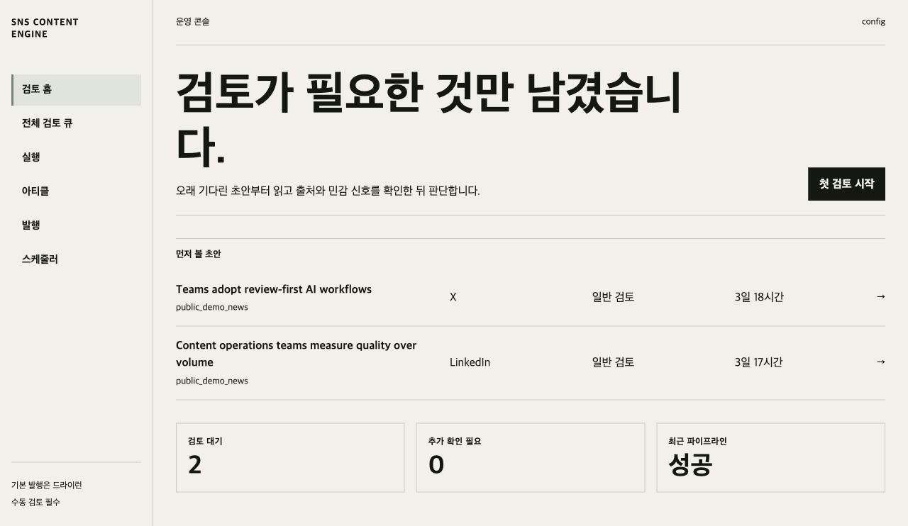
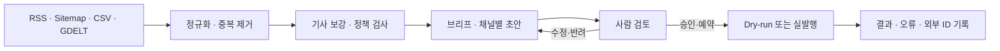
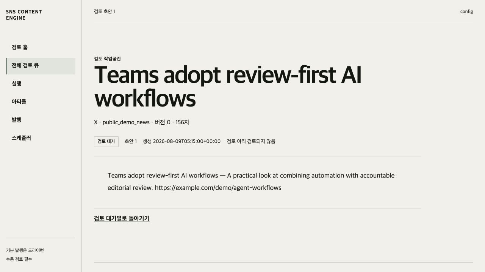

# SNS Content Engine

뉴스·정보 소스를 수집하고 채널별 초안을 만든 뒤, **사람의 검토를 거쳐 안전하게 발행하는** Python 기반 콘텐츠 운영 엔진입니다.

자동 게시량보다 출처 정책, 검토 가능성, 실패 추적, 되돌리기 어려운 외부 발행의 안전성을 우선합니다. 로컬 파이프라인은 항상 `pending_review`에서 멈추며, 실발행은 명시적인 `--live` 선택이 있어야 실행됩니다.



## 왜 만들었나

여러 주제와 채널을 운영할 때 반복되는 수집·정리·초안 생성은 자동화할 수 있지만, 출처의 이용 범위와 민감한 표현, 실제 게시 여부까지 자동화하면 운영 위험이 커집니다. SNS Content Engine은 이 경계를 명확히 나눕니다.

- RSS, Sitemap, CSV, GDELT 소스를 하나의 수집 흐름으로 정규화합니다.
- URL·제목·콘텐츠 fingerprint·DB 제약을 조합해 중복을 제거합니다.
- 소스의 `discovery_only`, `reusable`, `restricted` 정책을 수집 시점부터 보존합니다.
- OpenAI, Anthropic, Codex-Wrapper 등 생성 경로를 설정으로 교체합니다.
- X와 조건부 Threads 발행을 지원하고, Ghost·LinkedIn은 수동 전달 작업으로 관리합니다.
- CLI, JSON API, 서버 렌더링 콘솔이 같은 워크플로와 상태 모델을 사용합니다.

## 동작 흐름



## 새 운영 콘솔

운영 콘솔은 카드형 현황판에서 **검토 큐 중심의 편집형 워크스페이스**로 재설계했습니다.

- 검토 홈은 가장 오래 기다린 초안을 먼저 보여주고, 민감 신호가 있는 항목을 표시하며 추가 확인 건수를 집계합니다.
- 검토 상세는 콘텐츠, 출처·브리프·보강 근거, 판단 기록을 하나의 읽기 흐름으로 연결합니다.
- 승인, 수정, 반려, 예약, 수동 발행 결과 기록을 기존 서버 검증 규칙 안에서 처리합니다.
- 실행, 아티클, 발행 작업, 스케줄러 화면도 같은 선 기반 정보 체계를 사용합니다.
- 데스크톱 좌측 레일은 모바일에서 접이식 탐색으로 전환되며, 축소 모션 환경에서도 모든 기능이 유지됩니다.
- 잉크 블랙, 웜 아이보리, 세이지 포인트로 상태 색상보다 정보 위계와 문구를 강조합니다.



## 5분 빠른 시작

Python 3.12 또는 3.13이 필요합니다. API 키나 실제 계정 없이 공개 샘플 데이터로 콘솔을 실행할 수 있습니다.

```bash
python3.13 -m venv .venv
source .venv/bin/activate
python -m pip install -e ".[dev]"
./demo/run_demo.sh
```

브라우저에서 <http://127.0.0.1:8000/console/>을 엽니다. 데모는 실행할 때마다 `demo/demo.db`를 공개 샘플 데이터로 다시 만들며, 외부 발행 권한이나 비밀정보를 포함하지 않습니다. 자세한 내용과 동작 영상은 [데모 안내](demo/README.md)를 참고하세요.

## 로컬 파이프라인 실행

실제 설정으로 한 번의 로컬 파이프라인을 실행하려면 다음 순서를 사용합니다.

```bash
source .venv/bin/activate

sns-engine db init --database-url sqlite:///data/sns_content_engine.db
sns-engine healthcheck \
  --config-dir config \
  --database-url sqlite:///data/sns_content_engine.db
sns-engine run-local \
  --config-dir config \
  --database-url sqlite:///data/sns_content_engine.db
sns-engine review list \
  --database-url sqlite:///data/sns_content_engine.db
```

`run-local`은 `ingest → enrich → build-briefs → generate-drafts`를 실행하고 초안을 `pending_review` 상태로 저장합니다. 자동 승인이나 자동 발행은 하지 않습니다.

운영 콘솔과 API 문서를 함께 실행합니다.

```bash
uvicorn app.api:create_app --factory --host 127.0.0.1 --port 8000
```

| 화면 | URL |
| --- | --- |
| 운영 콘솔 | <http://127.0.0.1:8000/console/> |
| OpenAPI 문서 | <http://127.0.0.1:8000/docs> |
| 상태 확인 | <http://127.0.0.1:8000/health> |

## 설정

운영 동작은 YAML과 환경변수로 분리합니다.

| 파일 | 역할 |
| --- | --- |
| `config/accounts.yaml` | 계정, 채널, 일정, 게시자 설정 |
| `config/sources.yaml` | 소스 종류, URL, 이용 정책 |
| `config/prompts.yaml` | 채널별 생성 프롬프트 |
| `config/providers.yaml` | LLM route 순서와 모델 override |
| `.env` | API 키, DB URL, 게시자 credential bundle |

`.env.example`을 시작점으로 사용하되 실제 키는 Git에 커밋하지 않습니다. 생성 provider 자격 증명이 없으면 개발 환경에서 deterministic fake provider를 사용합니다. `providers.yaml`에 지정한 live provider가 선택된 뒤 실패한 경우에는 fake 출력으로 조용히 대체하지 않고 오류를 반환합니다.

예제 설정은 다음 디렉터리에 있습니다.

- `config/global_country_news/` — 한국·일본 글로벌 뉴스 운영 예시
- `config/examples/finance_local/` — 로컬 금융 콘텐츠 흐름 예시
- `config/examples/all_domain_news/` — 소스 정책 범주를 포함한 전체 도메인 예시

`config/examples/` 아래 파일과 `example.com` 계열 URL은 운영 준비가 끝난 설정으로 간주하지 않습니다. 복사한 뒤 승인된 소스와 계정 값으로 교체하세요.

## 주요 CLI

| 목적 | 명령 |
| --- | --- |
| 준비 상태 점검 | `sns-engine healthcheck --config-dir config` |
| 소스 발견 | `sns-engine discover --config-dir config` |
| 수집·저장 | `sns-engine ingest --config-dir config` |
| 기사 보강 | `sns-engine enrich-articles --config-dir config` |
| 브리프 생성 | `sns-engine build-briefs --config-dir config` |
| 채널별 초안 생성 | `sns-engine generate-drafts --config-dir config` |
| 검토 목록 | `sns-engine review list` |
| 승인 | `sns-engine review approve 42 --reviewer editor` |
| 반려 | `sns-engine review reject 42 --reason "Off topic"` |
| 수정 | `sns-engine review edit 42 --body "Revised draft text"` |
| 예약 | `sns-engine review schedule 42 --scheduled-for 2026-08-14T09:00:00+09:00` |
| 발행 dry-run | `sns-engine scheduler publish-due` |
| 실발행 | `sns-engine scheduler publish-due --live` |
| 실행·실패 이력 | `sns-engine history runs`, `sns-engine history failures` |

모든 명령은 `python -m app.cli ...` 형식으로도 실행할 수 있습니다.

## 발행 안전 원칙

- `scheduler publish-due`는 기본적으로 dry-run입니다.
- 실발행은 환경변수로 publisher 자격 증명을 제공하고 `--live`를 명시해야 합니다.
- Ghost와 LinkedIn은 수동 업로드 후 결과를 기록하는 handoff 경로입니다.
- Threads는 계정 설정과 credential bundle이 모두 유효할 때만 live 경로를 사용하며, 그 외에는 수동 handoff로 돌아갑니다.
- 실패한 발행 작업은 자동 재시도하지 않습니다. 원인을 수정한 뒤 승인된 초안을 다시 예약합니다.
- 원격 서버에서는 FastAPI 앱을 `127.0.0.1:8000`에 유지하고 Caddy와 Basic Auth 경계 뒤에서 제공합니다. 앱을 공개 `0.0.0.0` 주소로 직접 노출하지 않습니다.

배포나 재시작 후에는 보호된 edge 경로와 dry-run 동작을 확인합니다.

```bash
export SNS_SMOKE_EDGE_USER=operator
read -s SNS_SMOKE_EDGE_PASSWORD
export SNS_SMOKE_EDGE_PASSWORD
scripts/single_server_smoke_check.sh
```

단일 서버 설치, 백업과 롤백 순서는 [배포 가이드](docs/single-server-deployment-guide.md)를 따릅니다.

## 프로젝트 구조

```text
app/
  analytics/    운영 지표 집계
  api/          FastAPI, JSON API, Jinja 운영 콘솔
  config/       YAML 스키마와 로더
  connectors/   source / LLM / publisher / TTS 어댑터
  domain/       중복 제거·매칭·브리프 도메인 로직
  scheduler/    슬롯 계획·백필·예약 발행
  services/     추출·생성·검증 서비스
  storage/      SQLAlchemy 모델과 repository
  workflows/    단계별 유스케이스와 검토 전이
config/         운영·예제 설정
demo/           credential-free 공개 데모
deploy/         systemd·Caddy 자산
docs/           사례 분석·운영 회고·배포 가이드
operations/     반복 측정 가능한 운영 지표 이력
scripts/        DB·데모·smoke check·지표 도구
tests/          단위·통합·운영 경계 테스트
```

## 품질 확인

로컬에서 CI와 같은 검사를 실행합니다.

```bash
ruff check .
mypy
pytest -q --cov=app --cov-report=term-missing --cov-report=xml:coverage.xml
scripts/scan_secrets.sh check
```

GitHub Actions는 pull request와 `master` push에서 Ruff, 점진적 타입 검사, 전체 테스트, branch coverage 80% 기준을 확인하고 `coverage.xml`을 artifact로 보관합니다.

## 운영 지표

14일 또는 28일 창의 처리량, 중복 제거율, 승인율, 수정률, 발행 성공률을 같은 정의로 내보냅니다.

```bash
python scripts/export_operation_metrics.py \
  --database-url sqlite:///data/sns_content_engine.db \
  --days 28
```

결과는 [operations/metrics-history.csv](operations/metrics-history.csv)에 누적할 수 있습니다. 분모가 0인 비율은 0%가 아니라 빈 값으로 기록합니다.

## 현재 범위

- Ghost Admin API와 LinkedIn 자동 발행은 구현하지 않았습니다.
- Threads live 발행은 지원하지만 기본 country-news 설정에서는 명시적으로 활성화하기 전까지 수동 경로를 사용합니다.
- 장문 생성은 단일 기사 기준입니다. 여러 출처를 엮는 일간·주간 브리프의 provenance 모델은 아직 없습니다.
- TTS와 metadata provider는 통합 기반만 있으며 메인 CLI 파이프라인 단계로 노출하지 않습니다.
- X, Threads, LinkedIn 초안은 원문 URL을 사용합니다. Ghost 결과 URL을 기록해도 기존 소셜 초안을 블로그 funnel로 바꾸지 않습니다.

## 문서

- [사례 분석](docs/portfolio-case-study.md) — 문제 정의, 설계 결정, 트레이드오프, 검증 근거
- [운영 회고](docs/deployment-retrospective-2026-04-28.md) — 실제 배포에서 얻은 교훈과 다음 게이트
- [단일 서버 배포 가이드](docs/single-server-deployment-guide.md) — 설치, 보안, 백업, 롤백
- [과거 프로젝트 노트](archive/project-notes/README.md) — 이전 tracker, roadmap, prompt, 운영 기록

## 저자와 AI 활용

- **저자·프로젝트 소유자:** `internalforces` (`81242244+internalforces@users.noreply.github.com`)
- **AI 활용:** Codex를 구현 초안, 반복 리팩터링, 테스트 보강, 문서 구조 정리와 변경 검토에 사용했습니다.
- **직접 판단:** 문제 정의, 출처 정책, 사람 검토 경계, 채널별 자동화 범위, 상태 모델, 운영 지표와 최종 변경 수용 여부는 프로젝트 소유자가 결정합니다.
- **검증 원칙:** AI가 제안하거나 생성한 변경은 자동 테스트, 정적 검사, 운영 검토를 통과한 경우에만 반영합니다.
