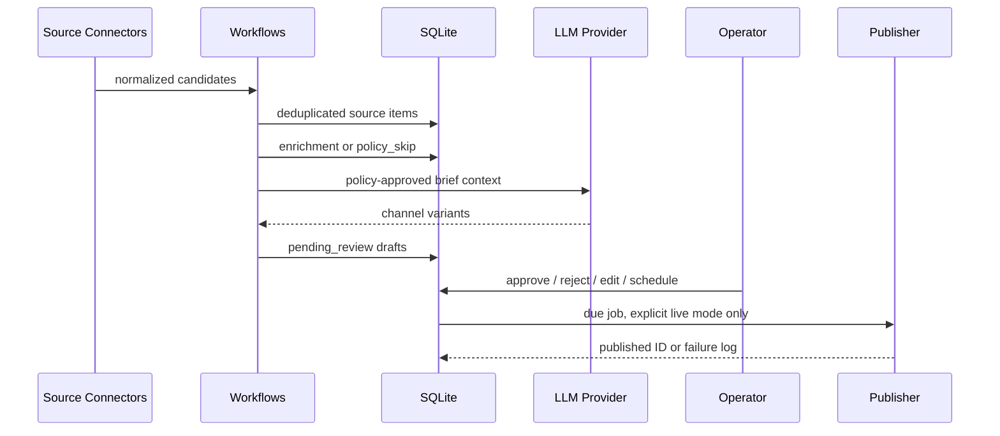

# SNS Content Engine — 포트폴리오 기술 사례

이 문서는 코드 리뷰나 기술 면접에서 프로젝트의 설계 의도와 구현 근거를 빠르게 확인하기 위한 사례 분석입니다. 사용자용 실행 방법은 [루트 README](../README.md), 실제 운영 절차는 [운영 문서 맵](README.md)을 참고합니다.

## 1. 문제 정의

여러 뉴스 출처에서 콘텐츠를 발견해 여러 SNS 계정에 게시하려면 “수집 → AI 생성 → 게시”보다 넓은 운영 문제가 생깁니다.

- 출처별 이용 정책이 달라 전문 수집과 재작성을 일괄 적용할 수 없습니다.
- URL과 제목이 조금씩 다른 동일 기사가 반복 수집될 수 있습니다.
- 채널별 길이·링크·말투·발행 기능이 서로 다릅니다.
- AI 결과에는 사실성, 맥락, 민감 주제, 출처 표기 검수가 필요합니다.
- 스케줄러 재실행과 외부 API 오류가 중복 게시 또는 상태 불일치를 만들 수 있습니다.
- 운영자가 실패, 의도적 생략, 검수, 발행 결과를 사후 추적할 수 있어야 합니다.

따라서 목표를 “글을 자동으로 만드는 도구”가 아니라 **정책과 사람의 판단을 포함한 콘텐츠 운영 제어면(control plane)** 으로 정의했습니다.

## 2. 요구사항과 제약

| 영역 | 선택한 기준 | 이유 |
| --- | --- | --- |
| 운영 규모 | 단일 서버, SQLite | 초기 운영 복잡도와 비용 최소화 |
| 자동화 범위 | 초안 생성까지 자동, 게시 전 수동 검수 | 잘못된 자동 게시의 비용이 큼 |
| 초기 실발행 | X만 활성화 | 작은 범위에서 운영 안정성 검증 |
| 다른 채널 | Ghost·LinkedIn 수동 인계, Threads opt-in | 채널별 API 준비도 차이를 상태 모델에 반영 |
| 출처 이용 | 소스별 정책 설정 | 기술적으로 가능하다는 이유만으로 전문을 수집하지 않음 |
| 실패 처리 | 기록 후 수동 재예약 | 외부 부작용이 있는 작업의 무제한 자동 재시도 방지 |
| 비밀정보 | 환경변수만 사용 | 설정 파일과 로그를 통한 노출 방지 |

## 3. 시스템 흐름



핵심은 AI 호출이 시스템의 중심이 아니라는 점입니다. 저장된 상태와 명시적인 전이 경계가 각 단계를 연결하고, CLI·API·웹 콘솔은 같은 애플리케이션 서비스를 호출합니다.

## 4. 주요 기술 의사결정

### 4.1 설정 중심 확장

계정·소스·프롬프트·AI 경로를 코드에서 분리했습니다.

- [`config/accounts.yaml`](../config/accounts.yaml): 계정 주제, 매칭 규칙, 채널 제약, 게시 자격 증명 참조
- [`config/sources.yaml`](../config/sources.yaml): 커넥터 종류와 출처 정책
- [`config/prompts.yaml`](../config/prompts.yaml): 채널별 생성 규칙
- [`config/providers.yaml`](../config/providers.yaml): 작업별 AI 공급자 우선순위와 모델
- [`app/config/schemas.py`](../app/config/schemas.py): Pydantic 기반 설정 계약과 시작 시 검증

**트레이드오프:** YAML은 배포 없이 운영값을 바꾸기 쉽지만 잘못된 조합이 런타임까지 들어올 수 있습니다. 이를 줄이기 위해 스키마 검증, registry 조회, operator-readiness healthcheck를 함께 구현했습니다.

### 4.2 출처 정책을 도메인에 보존

수집 시점의 정책을 `SourceItem`에 스냅샷으로 저장합니다. 이후 설정이 바뀌더라도 해당 콘텐츠가 어떤 조건으로 들어왔는지 추적할 수 있습니다.

- `policy_mode`: `discovery_only`, `reusable`, `restricted`
- `allow_full_text_fetch`: 전문 요청 허용 여부
- `allow_llm_rewrite`: AI 재작성 허용 여부
- `require_attribution`: 초안의 출처 표기 요구

[`app/workflows/enrich_articles.py`](../app/workflows/enrich_articles.py)는 금지된 단계를 실패로 가장하지 않고 정책 생략으로 기록합니다. [`app/workflows/history_queries.py`](../app/workflows/history_queries.py)는 실제 실패와 `policy_skip`을 분리해 제공합니다.

**트레이드오프:** 정책 필드가 여러 레이어에 전달되어 모델이 복잡해지지만, 운영 설명 가능성과 출처 준수 여부를 얻었습니다.

### 4.3 여러 층의 중복 제거

단일 비교 방식 대신 서로 다른 중복 형태를 잡는 키를 조합했습니다.

1. `source_key + external_id`: 같은 소스 항목의 재수집 방지
2. canonical URL: 추적 파라미터 등 URL 표현 차이 정규화
3. normalized title hash: URL은 다르지만 제목이 같은 항목 감지
4. content fingerprint + recent claim: 최근 기간의 유사 콘텐츠 경쟁 삽입 직렬화

DB unique constraint와 repository 처리를 함께 사용해 단순 사전 조회 후 삽입에서 생길 수 있는 경쟁 조건을 줄였습니다. 구현은 [`app/domain/source_deduplication.py`](../app/domain/source_deduplication.py), [`app/storage/models.py`](../app/storage/models.py), [`app/storage/repositories.py`](../app/storage/repositories.py)에서 확인할 수 있습니다.

### 4.4 Human-in-the-loop 상태 모델

초안 상태는 `pending_review → approved | rejected`로 이동하며 승인, 반려, 본문 수정, 예약을 별도의 감사 액션으로 저장합니다. 게시 기능이 없는 채널을 “실패한 자동 게시”로 취급하지 않고 `scheduled_for = null`인 수동 인계 작업으로 표현했습니다.

이 구조 덕분에 운영자는 다음을 구분할 수 있습니다.

- 생성됐지만 아직 검토되지 않은 초안
- 승인됐지만 예약되지 않은 초안
- 외부 채널에 수동 업로드해야 하는 작업
- 예약 발행 대기·진행·성공·실패·취소 작업

주요 구현은 [`app/workflows/review_queue.py`](../app/workflows/review_queue.py)와 [`app/storage/models.py`](../app/storage/models.py)입니다.

### 4.5 안전한 예약 발행

외부 게시 API는 되돌리기 어려운 부작용을 만듭니다. 다음 안전 기본값을 적용했습니다.

- `publish-due`는 기본 dry-run이며 `--live`를 명시해야 실발행
- draft/channel/schedule 기반 멱등성 키로 같은 작업의 중복 생성 방지
- 발행 전 작업을 durable claim해 동시 실행 충돌 축소
- 외부 게시물 ID, 시도 횟수, 마지막 오류, 이벤트 로그 저장
- 실패 시 자동 무한 재시도 대신 원인 수정 후 수동 재예약
- backlog target, 최소 간격, window, deterministic jitter를 반영한 슬롯 계획

관련 코드는 [`app/scheduler/jobs.py`](../app/scheduler/jobs.py), [`app/scheduler/planner.py`](../app/scheduler/planner.py), [`app/connectors/publishers/`](../app/connectors/publishers/)에 있습니다.

### 4.6 포트와 어댑터를 이용한 외부 연동 격리

외부 시스템은 변경과 장애가 잦으므로 도메인 흐름에서 분리했습니다.

| 포트 | 구현 예시 | 테스트 대체재 |
| --- | --- | --- |
| Source connector | RSS, Sitemap, Manual CSV, GDELT | fixture/fake connector |
| Draft provider | OpenAI, Anthropic, Codex-Wrapper | deterministic fake |
| Publisher | X, Threads | fake publisher/executor |
| TTS provider | OpenAI, ElevenLabs, Google | fake TTS |

Resolver는 설정과 환경변수로 구현체를 선택합니다. 워크플로 테스트는 네트워크 대신 fake를 주입해 도메인 상태 전이를 결정론적으로 검증합니다.

## 5. 운영 인터페이스

동일한 핵심 기능을 사용 목적에 맞게 세 가지 표면으로 제공합니다.

- **CLI:** 개발, 배치, 장애 대응에 적합
- **JSON API:** 운영 자동화와 향후 프론트엔드 연동에 적합
- **웹 콘솔:** 검수 큐, 기사 상태, 발행 작업, 스케줄러를 비개발자가 다루기 적합

웹 콘솔은 별도 비즈니스 로직을 만들지 않고 API/워크플로 레이어의 서비스를 재사용합니다. FastAPI 앱은 [`app/api/app.py`](../app/api/app.py), 콘솔은 [`app/api/console.py`](../app/api/console.py)에서 확인할 수 있습니다.

## 6. 테스트 전략과 검증 결과

2026-08-09에 Python 3.13.12 환경에서 전체 테스트를 실행해 다음 결과를 확인했습니다.

```text
561 passed in 14.73s
```

실행 명령:

```bash
PYTHONPATH=. ./.venv/bin/pytest -q
```

검증 범위는 다음을 포함합니다.

- 설정 스키마와 공급자 라우팅
- URL·제목·fingerprint 중복 제거와 동시성 경계
- RSS/Sitemap/CSV/GDELT 커넥터 정규화
- 기사 fetch/extract/summary의 성공·실패·정책 생략
- 콘텐츠 매칭, 브리프, 채널별 초안 제약과 출처 표기
- 검수 상태 전이와 감사 이력
- 스케줄 슬롯, backfill, dry-run, live publish, 멱등성
- X/Threads 게시자 오류 매핑
- CLI, API, 웹 콘솔, 배포 스크립트

테스트 시간은 현재 로컬 환경의 참고값이며 성능 벤치마크로 사용하지 않습니다.

## 7. 배포와 운영성

초기 규모에 맞춰 하나의 서버에서 웹 프로세스와 스케줄러 프로세스를 분리했습니다.

- FastAPI/Uvicorn은 `127.0.0.1`에만 바인딩
- Caddy가 HTTPS와 Basic Auth 경계 제공
- 웹과 스케줄러가 동일한 `.env`, `config`, SQLite DB 사용
- systemd가 프로세스 수명주기와 journald 로그 관리
- healthcheck가 설정, 예제 placeholder, DB 스키마 준비 상태 검사
- smoke check, SQLite backup, 이전 release symlink rollback 절차 제공

세부 절차와 장애 시 복구 순서는 [단일 서버 배포 가이드](single-server-deployment-guide.md)에 있습니다.

## 8. 의도적으로 남겨 둔 경계

| 현재 경계 | 이유 | 확장 방향 |
| --- | --- | --- |
| SQLite 단일 서버 | MVP 운영 복잡도 최소화 | PostgreSQL, 분산 작업 큐, 리더 선출 |
| X 중심 실발행 | 채널 API 위험을 단계적으로 검증 | Threads opt-in 확대, 새 publisher adapter |
| Ghost·LinkedIn 수동 인계 | 공식 API 연동보다 검수 흐름을 우선 | credential/권한 모델 완성 후 live adapter |
| 단일 기사 장문 | 출처 추적이 명확함 | 다중 출처 provenance와 aggregation 모델 |
| Basic Auth | 보호된 소규모 운영에 충분 | 사용자 계정, 역할 기반 권한, CSRF 강화 |
| 수동 재예약 | 중복 부작용 방지 우선 | 오류 유형별 제한적 backoff/retry 정책 |

이 표는 미완성 기능을 감추기 위한 것이 아니라, 현재 선택이 어떤 규모와 위험 가정에 맞춰졌는지를 명확히 하기 위한 것입니다.

## 9. 코드 리뷰 추천 순서

시간이 제한된 리뷰에서는 다음 순서로 보면 설계 의도를 빠르게 파악할 수 있습니다.

1. [`app/workflows/run_local_pipeline.py`](../app/workflows/run_local_pipeline.py) — 전체 유스케이스와 단계 이력
2. [`app/storage/models.py`](../app/storage/models.py) — 도메인 상태와 감사 데이터 모델
3. [`app/workflows/review_queue.py`](../app/workflows/review_queue.py) — 사람 검수 및 수동 인계 경계
4. [`app/scheduler/jobs.py`](../app/scheduler/jobs.py) — 안전한 backfill/dry-run/live publish
5. [`app/services/x_draft_generator.py`](../app/services/x_draft_generator.py) — 채널 제약, provenance, 출처 표기
6. [`app/api/app.py`](../app/api/app.py) — 운영 API 계약
7. [`tests/test_scheduler.py`](../tests/test_scheduler.py), [`tests/test_review_queue_workflow.py`](../tests/test_review_queue_workflow.py) — 핵심 위험의 자동화 검증

## 10. 면접에서 논의할 수 있는 주제

- AI 기능과 전통적인 상태 기반 워크플로를 어디에서 분리했는가
- 출처 정책을 설정뿐 아니라 수집 시점 데이터로 저장한 이유
- 외부 부작용이 있는 작업에서 exactly-once 대신 어떤 현실적 보장을 선택했는가
- 자동화율보다 검수 가능성과 설명 가능성을 우선한 이유
- SQLite에서 동시성 위험을 줄인 방법과 PostgreSQL 전환 시 바꿀 부분
- fake adapter와 dependency injection이 테스트 신뢰도에 준 효과
- 현재 규모의 단일 서버 설계가 언제 한계에 도달하는가
